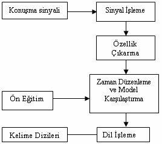

# BASİT BİR KONUŞMACI TANIMA ALGORİTMASI
 
# Giriş

Konuşmacı tanıma, ses işaretinin içerdiği bilginin kullanılması ile otomatik olarak kimin konuştuğunun belirlenmesi işlemidir. Konuşmacı tanıma, konuşmacı doğrulama ve konuşmacı belirleme olmak üzere ikiye ayrılır. Konuşmacı doğrulama, verilen bir ses örneğinin iddia edilen kişiye ait olup olmadığının tespiti, konuşmacı belirleme ise verilen ses örneğinin sistemde daha önceden kayıtlı olan kişilerden hangisine ait olduğunun saptanması işlemidir . Ayrıca konuşmacı tanıma işlemleri metinden bağımsız veya metne bağımlı olarak da iki gruba ayrılabilir. Metinden bağımsız konuşmacı tanıma sistemlerinde sistemin eğitim ve test aşamalarında farklı cümleler veya sözcükler kullanılırken metne bağımlı sistemlerde hem eğitim hem de test sırasında aynı cümle veya sözcükler kullanılmaktadır. Konuşmacı tanıma sistemlerinin kullanım alanları oldukça yaygındır. Örneğin son yıllarda, telefon bankacılığı, sesli arama, telefonla alışveriş, veritabanı erişim servisleri, bilgisayarların uzaktan sesle kontrolü ve en önemlilerinden biri de adli uygulamalar gibi birçok alanda kullanılmaya başlanmıştır . Ses işaretinin zamanla çok sık değişmesi (durağan olmaması), ortamdaki gürültü ve hava şartları gibi etmenlerden kolayca etkilenmesi nedeniyle bir örüntü tanıma problemi olarak konuşmacı tanıma işlemi diğer problemlere nazaran daha zor bir uygulamadır. Ses işaretinin durağan olmaması sistem tasarımcılarını işareti kısa zaman aralıklarında (10-20 ms) işlemeye zorlamakta ve bu zorunluluk veri boyutlarının oldukça yüksek olmasına neden olmaktadır . Büyük veri boyutları ise sınıflandırıcıların çalışma sürelerini artırmaktadır. Bundan dolayı bir konuşmacı tanıma sisteminde kullanılan sınıflandırma yönteminin hem yüksek başarım vermesi hem de hızlı sonuç üretmesi beklenmektedir.

# Konuşma Tanıma Teorisi

Ses teknolojisi yedi ortak konuşma uygulamalarını içermektedir. Şekil 2.1 de ses teknolojilerinin çeşitleri görülmektedir.

 

 
Ses teknolojisi içerisinde bulunan otomatik konuşma tanıma, sürekli konuşma tanıma, ayrık sözcük tanıma ve kelime yakalama sistemlerini içerisinde bulundurmaktadır. Diğer taraftan ses sentezleme, konuşmacı tanıma, dil tanıma, ses üretme, konuşmacı ayırımı ve ses kodlamayı da içine alan ses teknolojileri içinde en zor olan alan otomatik konuşma tanımayla ilgili olan alandır (3). Otomatik Konuşma tanıma
problemi, verilen bir akustik X dizisi için, W kelime dizilerini bulmak için oluşturulmuştur. Konuşma cümleleri, `W = (w1, w2, …, wt)` şeklinde belirtilen kelimelerin dizisi olarak gösterilir. 

## Konuşma Tanıma Teorisi ve Teknikleri 

wt, ayrık bir t zamanında söylenmiş belli bir kelimedir. Kelimelerin dizisi söylenen sesli ifade ile bağlantılıdır ve bu sesli ifade X
olarak gösterilen akustik sesler dizisidir.Otomatik konuşma tanıma oldukça zor ve karmaşık bir problemdir. Matematiksel olarak bir f fonksiyonu  `f: X → W ` şeklinde gösterilir . Otomatik konuşma tanıma teorisi oldukça geniş bir konudur. Genel olarak bir örüntü tanıma (pattern recognition) problemi olarak görülebilir. Konuşma sinyalinin stokastik yapısı istatistiksel yöntemlerle konuşma tanıma yapılmasını gerekli hale getirmektedir. Genel bir konuşma tanıma modeli şu modüllerden oluşmaktadır 

* Konuşma tanıma sinyalinin bir gösterimini elde etmek için sinyal işleme modülü
* Bu gösterimin anahtar elemanlarını belirlemek ve fazla bilgiyi çıkarmak için özellik
çıkarma modülü
* Kelime tespitini yapmak için zaman düzenleme ve model karşılaştırma algoritmaları
* Bir final kelime dizisi seçmek için dil modeli

 

Konuşma sinyalinin modellenmesi, sesli ifadelerin, bilgisayar destekli olarak tanıma sürecine sokulabilmesi için bunların öncelikle bu sürece hazırlanmaları gerekmektedir. Bu amaçla sesli ifadelerin bir mikrofon aracılığıyla örneksel sinyallere dönüştürülmesi,
sayısallaştırılması, sayısallaştırılan bu sinyallerin gerekirse filtrelenmesi, etiketlenmesi (örneğin sesler, fonemler, sözcükler olarak) ve tanıma işlemlerine taban oluşturacak parametrik yapılar ya da yalın modellerle ifade edilen biçimlere dönüştürülmesi
gerekmektedir. Sinyal işleme modülünün amacı, örneklenen konuşma sinyalini işlemek ve genlik değişimlerinden, konuşmacı stresinden, iletişim araçlarından veya kanalından gelen gürültüden bağımsız bir gösterim elde etmektir. Sayısala dönüştürme işlemleri sırasıyla örnekleme, nicelendirme ve kodlama aşamalarıdır. Örnekleme olarak sayısal işaretten belirlenen anda genlik değerlerinin alınması
düşünülmektedir. Nicelendirme, örneklenmiş işareti belirli aralıklara bölme ve basamaklandırma işlemidir. Kuantalama değeri her veriye ayrılacak olan bit sayısını ifade etmektedir. Kodlama ise kuantalanmış işaretin herhangi bir sayı sisteminde gösterilmesidir . Özellik çıkarım modülü, sinyaldeki geçişleri yakalayan parametrelerin kümesini hesaplar ve her fonemi göstermek için yeterince güçlüdür.
Bu parametreler genellikle özellikler olarak adlandırılırlar ve genellikle sabit-zaman aralıklarında hesaplanırlar. Sinyaldeki geçişler, konuşma sinyalindeki fonetik bilginin kodlanmasını gösterebilen önemli ipuçlarıdır . Giriş ses bilgisi işe yarayan ve yaramayan bir çok bilgi içermektedir. Örneğin, ses bilgisi kelimenin ne olduğu, konuşanın cinsi, duyguları ve fiziksel durumu gibi bize çok sayıda bilgi
vermektedir. Ses tanıma siteminde işimize yarayan bilgiler seçilmeli ve diğerleri ise çıkartılmalıdır. Yararlı bilgi özellikleri içermeli ve örüntüleri birbirinden ayırmayı sağlayabilmelidir. Özelliklerin belirlenmesi örüntü tanımanın en önemli aşamasıdır.
Segmentasyon işlemi cümledeki kelimeleri ayırma işlemidir. Konuşulan kelimenin başının ve sonunun bulunması çok zor bir problemdir. Bu zorluk sesin bitişi ile diğerinin başlangıcı arasında kesin sınırın belirlenememesinden kaynaklanmaktadır. Zaman düzenleme ve model karşılaştırma modülü, bir kelimeyi, o kelimenin verilen gösterimlerine dayanarak karşılaştırmayı dener. Zaman düzenleme, modellenmiş
akustik veya fonetik olayların düzenlenmesi için, konuşma oranındaki değişikliklerden dolayı “sözdeki zaman bozulmalarını” referans alır. Bu zaman bozulması veya geçici değişimler, doğal olarak olur ve özellikle konuşma oranındaki değişimler seslilerin süresini önemli şekilde etkiler. Zaman düzenleme ve model karşılaştırma, bir kelime modelini formüle etmek için kullanılan eğitim yöntemlerine bağlıdır. Kelime modeli, eğitim safhası esnasında çıkarılan parametrelerin kümesinden oluşur. Dil işleme modülü, konuşma tanıma işleminin
son aşamasıdır. Hangi dile yönelik konuşma tanıma sistemi hazırlanacaksa o dile ait çeşitli kuralların bilinmesi ve bu kurallara uyarak çalışılması gerekmektedir. Dile ait bu yapılar bilinerek kelime seçimlerinin oluşturulmasıyla ilgili modüldür. Konuşma tanıma sistemleri kabul ettikleri girdi ses sinyalinin ve içermesi beklenen metin karşılıklarının yapılarına göre çeşitli dallar altında incelenir:

* Ses sinyalinin tek veya çok kişiye ait olabilmesi: Konuşmacıya bağlılık
* Tanınacak metin kümesinin genişliği: Dağarcık
* Tanınacak seste metin elemanlarının yerleşimi: Sürekli, bağlı veya ayrık tanıma

## Konuşma Tanıma Sistemlerinin Sınıflandırılması

Konuşma tanıma programları, alanların ihtiyacına göre tasarlanır. Bu alanlarda çıkan sorunların çözümü için değişik sistemler ve metotlar geliştirilmiştir. Sesli ifade sistemleri ya da sesli ifade tanıyıcılar, artan zorluk sırasına göre aşağıda sıralanmıştır:
* Ayrık sözcük tanıma sistemleri (isolated word recognition systems), 
* Sözcük yakalama sistemleri (word spotting systems),
* Sürekli konuşma tanıma sistemleri (continous speech recognition system).

# Konuşma Tanımada Kullanılan Teknikler 

Konuşma tanımada kullanılan belli başlı üç teknik vardır. Bunlar; 

* Neural Networks (Yapay Sinir Ağları) 
* Time warping - dynamic time warping (Dinamik Zaman Eşleştirme)
* Hidden Markov Models (Saklı Markov Modelleri)
 

# Kaynaklar 

* Nabiyev, V. “Yapay Zeka”, ISBN 975 347 985 9, Seçkin Yayıncılık San. Ve Tic. A. Ş., s. 704-714, Ankara, 2005. 
* Yalçın, N. ve Bay, Ö.F. “İlköğretim birinci sınıf öğrencilerine konuşma tanıma teknolojisi yardımıyla ilkokuma yazma öğretimi”, 6th International Educational Technılogy Conference, Eastern Mediterranean University, , vol:3, , 19-21 April, pp:1659, Famagusta, North Cyprus, 2006. 
* Morgan, D. and Scofield, L. C., “Neural Networks and Speech Processing”, Kluwer Academic Publishers, pp. 102-108, USA, 1991.
* Becchetti, C., and Ricotti L. P., “Speech Recognition Theory and C++ Implementation”, ISBN 0-471-97730-6, John Wiley & Sons Ltd, 167-188, 310- 311, England, 1999.
* Gökhan, A., “Yapay Sinir Ağları İle Ayrık Türkçe Sözcüklerin Tanınması”, Yüksek Lisans Tezi, Fırat Üniversitesi Fen Bilimleri Enstitüsü,  s. 1-17, Elazığ, 1997.
* Jurafsky, D. & Martin, J. H., “Speech and Language Processing An Inroduction to Natural Language Processing, Computational Linguistics, and Speech Recognition”, ISBN 0-13-122798-X, Prentice Hall Upper Saddle River, pp. 235- 249, New Jersey, USA, 2000. 
* Mengüşoğlu, E., “Bir Türkçe Sesli İfade Tanıma Sisteminin Kural Tabanlı Tasarımı ve Gerçekleştirimi”, Yüksek Mühendislik Tezi, Hacettepe Üniversitesi Fen Bilimleri Enstitüsü, s. 14-16, 22-26, Ankara, 1999.

